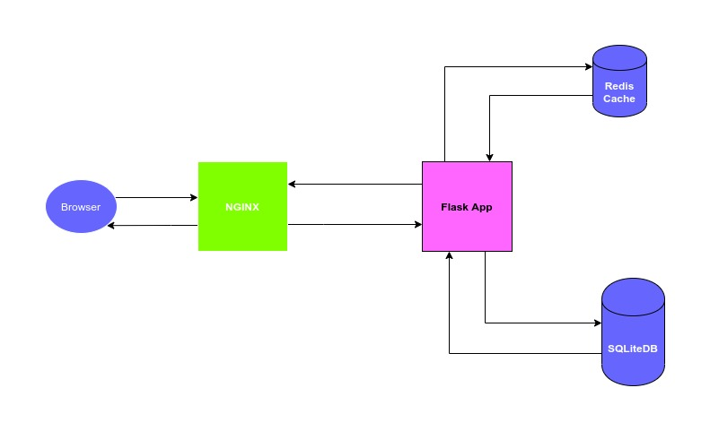

### UrlShortner

#### Documentation
http://app.vijaykarthikurlshortner.co.vu/documentation

### Endpoints

**GET**  http://app.vijaykarthikurlshortner.co.vu/shortner  
**Description**: List of shortned urls  
**Sample response**  
```
{
  "success": true,
  "message": "url does not exist",
  "data": [
    {
      "short_name": "pybit",
      "updated_at": null,
      "created_at": "2020-02-22T09:57:20.284512",
      "url": "https://pybit.es/pages/challenges.html"
    },
  ]
}
```
**POST** http://app.vijaykarthikurlshortner.co.vu/shortner  
**Description**: Creates shortned url  
**Sample Post Data**:  
```
{
  "url": "https://docs.google.com/a/yellowmessenger.com/document/d/12TxT2LjnWHYAuHGq5yQBxj3IVUehW-XfHgwEbR8W5nw/edit?usp=drive_web",
  "short_name": "yellow-messenger"
}
```
url - Long url that needs to be shortned. This is a required parameter
short_name - Shortname that needs to be given to the long url. This is optional

If shortname already exists the endpoint will return 400 with message the message shortname already exists choose a different shortname

**Sample response**
```
{
  "success":true,  
  "message":"URL shortner successfully created",  
  "data":{
    "shortned_url":"http://app.vijaykarthikurlshortner.co.vu/yellow-messenger"  
  }
}
```
**GET** http://app.vijaykarthikurlshortner.co.vu/time_series_plot  
**Description**: Returns shortned urls time series data  
**Sample response**  
```
{
  "success":true,  
  "message":"Time series data successfully retrieved",  
  "data":[
    {
      "date":"2020-02-22",  
      "count":1  
    },  
    {
      "date":"2020-02-23",  
      "count":3  
    },  
    {
      "date":"2020-02-24",  
      "count":1  
    } 
  ]
}
```

## Architecture Diagram


